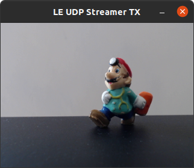
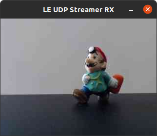
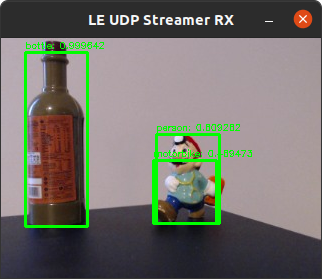
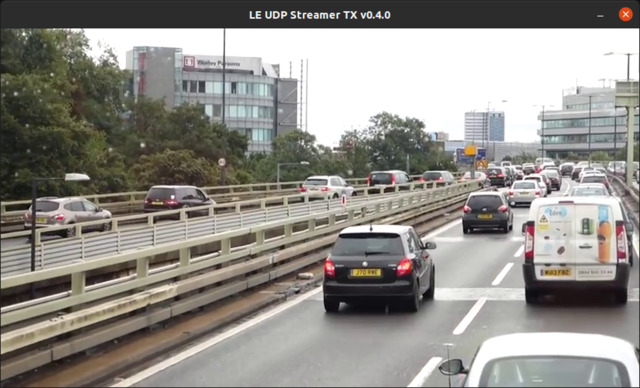
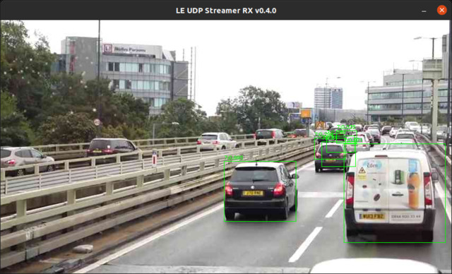

# LIQUID EDGE OpenCV-based Webcam Streaming and Inference Subsystem


> These programs are part of the system used for the LIQUID EDGE PRIN 2017 project demonstrator.

The _liquid-edge-ocv-cam-streamer_ programs ensemble is used to setup, operate, and maintain a flawless video stream from an high-definition video camera located on a robot chassis, towards one endpoint dwelling somewhere among the network edge nodes. The receiver is able to perform object detection of the scene by using a deep neural network (DNN) engine, where the DNN configuration and weights can be taken e.g. from the _liquid-edge-model-zoo_ repository. The programs are supposed to operate in all environments where OpenCV 4 is available: the framework has been tested successfully under Windows 8.1/10, macOS Big Sur, and Ubuntu 20.04. 

The framework is composed by two programs:

* `le_ocv_cam_streamer_tx`: the streaming transmitter;
* `le_ocv_cam_streamer_rx`: the streaming receiver and inferrer.

## Usage

### Transmission: *le_cam_streamer_tx*

This program captures from the webcam with the selected resolution and frame rate, encodes the frames with JPEG at the desired quality or bit rate, streams the compressed data over UDP/IP or TCP/IP to the receiver, and obtains back the inference results. There are many options that can be chosen from the command line (use the short form ```-o=value``` or the long form ```--option=value``` for valued options):

```cli
LIQUID_EDGE UDP video streaming transmitter v0.4.0,
Dec  5 2021 22:28:40, sockpp v0.7.0, OpenCV 4.5.3
Usage: le_ocv_streamer_tx [params] addr:port 

        -?, -h, --help, --usage (value:true)
                Prints this help and exits
        -V, --version
                Prints version and exits
        -b, --bitrate
                Compressed video bitrate (CBR)
        -c, --camera (value:0)
                Camera index
        -f, --framerate (value:30)
                Desired frame rate
        -k, --key (value:00000000)
                Engine access key
        -m, --movie
                Movie path
        -n, --novideo
                Do not show local video
        -o, --timeout (value:0)
                Waiting timeout (0 = never ends)
        -p, --psnr
                Calculate PSNR
        --plainversion, -v
                Prints only the version number and exits
        -q, --quality (value:40)
                Compressed video quality, 0 skips encoding (VBR)
        -r, --resolution (value:640x480)
                Desired frame resolution
        -s, --speed
                Speed-test mode
        -t, --time (value:0)
                Operation time (seconds, 0 = do not stop)
        --tcp
                Use TCP/IP
        -u, --udpsize (value:512)
                UDP packet size
        --udp
                Use UDP/IP (default)

        addr:port (value:localhost:15000)
                Destination host address and port
```

The output of the program has the following form

```cli
...
#562,Q:30;FR:20.9fps;BR:1084kbps;NO:1objs;AT=33.1ms;CT:1.0ms;RTT:59.2ms;📶 
...
```

where `Q` represents the JPEG compression quality used, `FR` is the frame rate produced by the camera and transmitted on the network, `BR` is the bit rate, `NO` is the number of objects returned by the inference engine running on the edge, `AT` is the time taken to acquire a frame, `CT` is the time taken to compress a frame, and `RTT` is the round-trip time needed to obtain the inference results for a frame. Eventually, the "📶" symbol declares an active link with the receiver, while the symbol "📴" states that the link is dead. Normally, the transmitter runs continuously, trying to stream to the selected destination.

By default, a window shows the captured frames in real time (Fig. 1): pressing `ESC` with the window in focus produces a clean exit from the program, while pressing `+` or `-` increases or decreases the JPEG compression quality (from 0 to 100), thus allowing a manual control of the bit rate.



_Figure 1._ Captured frame at the transmitter.

### Reception and inference: *le_cam_streamer_rx*

This program receives UDP/IP or TCP/IP packets from the other program, decodes the JPEG content, infers the scene with a DNN, and provides the detected objects list back to the transmitter. Options similar to those of the transmitter can be chosen from the command line:

```cli
LIQUID_EDGE UDP video streaming receiver v0.4.0,
Dec  5 2021 22:28:40, sockpp v0.7.0, OpenCV 4.5.3
Usage: le_ocv_streamer_rx [params] addr:port 

        -?, -h, --help, --usage (value:true)
                Prints this help and exits
        -V, --version
                Prints version and exits
        -c, --config (value:../liquid-edge-model-zoo/Caffe/MobileNetSSD_deploy.prototxt)
                DNN configuration file
        -f, --framework (value:caffe)
                Inference framework (caffe, darknet)
        -g, --gpu
                Use GPU where possible
        -i, --infer
                Perform inference using the given model and weights
        -k, --key (value:00000000)
                Engine access key
        -n, --novideo
                Do not show video
        -o, --timeout (value:0)
                Waiting timeout (0 = never ends)
        -p, --peekport (value:8087)
                Web peeking port
        --plainversion, -v
                Prints only the version number and exits
        --tcp
                Use TCP/IP
        --udp
                Use UDP/IP (default)
        -w, --weight (value:../liquid-edge-model-zoo/Caffe/MobileNetSSD_deploy.caffemodel)
                DNN weights file

        addr:port (value:localhost:15000)
                Listening address and port
```

The output of the program has the following form

```cli
...
#6246;FR:30.0fps;BR:47771kbps;LR:0.0%;DT:3.2ms;IT:20.3ms;📶    
...
```

where `#` prints the current frame number, `FR` is the frame rate produced after the inference engine, `BR` is the global incoming bit rate, `LR` is an estimate of the frame loss rate (due to network losses or inference latency), `DT` is the decompression time, and `IT` is the inference time. Eventually the "📶" symbol declares an active link with the transmitter, while the symbol "📴" means that the link is dead.

By default, a window shows the received frames in real time (Fig. 2): pressing `ESC` with the window in focus produces a clean exit from the program, while pressing `f` freezes the current fame for a more comfortable inspection.



_Figure 2._ Decompressed frame at the receiver.

When enabled, the inference engine detects the objects in the scene and highlights them with bounding boxes, object index, and detection confidence (Fig. 3).



_Figure 3._ Inferred frame at the receiver.

## Testing pre-recorded content

With the ```-m``` command-line option at the transmitter, it is possible to use a pre-recorded video clip, instead of the webcam, as a video source (all the formats recognized by _ffmpeg_ are supported). This way, the performance of the system can be verified under controlled conditions (Figs. 4 and 5).



_Figure 4._ Movie frame at the transmitter.



_Figure 5._ Inferred movie frame at the receiver.


## Compile and install

Both programs are written in C++17 and use the `sockpp` library for networking, thus it must be first downloaded and installed. The development of this framework is carried out with Visual Studio Code/CMAKE and tested on three platforms (Windows 8.1/10, macOS Big Sur, Ubuntu 20.04). Under Ubuntu Linux, all the required dependencies are installed with

```cli
$ sudo apt update
$ sudo apt upgrade
$ sudo apt install build-essential cmake git libopencv-dev
```

To compile the programs, issue these commands:

```cli
$ git clone https://github.com/gbaruffa/liquid-edge-ocv-cam-streamer
$ cd liquid-edge-ocv-cam-streamer
$ mkdir build
$ cd build
$ cmake ..
$ make
```

Since the streaming part uses a network socket, it must be opened in the firewall of your machine and network. For instance, under Ubuntu Linux, you need to allow (UDP and TCP) traffic on this port with

```cli
$ sudo ufw allow 15000
```

If, for any reason, you need to change the default streaming port number, please also remember to add/update the relevant rule in the firewall.

### Advanced installation

OpenCV may efficiently use GPUs to perform the computer vision tasks. The receiving program can be accelerated by GPUs using NVIDIA CUDA. To benefit from the GPU acceleration, you might want to install OpenCV manually after compiling it from source. The steps are beyond this documentation, however I will try to detail them a little more.

* Install ```NVIDIA drivers``` from NVIDIA website (https://www.nvidia.it/Download/index.aspx): the proprietary drivers provided by Linux distributions (e.g., Ubuntu's ```nvidia-driver``` package) are good as well.
* Install ```CUDA``` from NVIDIA website (https://developer.nvidia.com/cuda-downloads): select the exact combination of OS/CPU/architecture/packaging to get what you need.
* Install ```cuDNN``` from NVIDIA website (https://developer.nvidia.com/cudnn): you need to register yourself as a developer to get the precompiled libraries. Please select the cuDNN libraries __exactly__ matching your CUDA version major number (e.g., ```/usr/local/cuda/bin/nvcc -V```).
* Uninstall any previous version of OpenCV, especially if it is prepackaged for your OS (e.g., Ubuntu's ```libopencv-dev```).
* Download OpenCV 4 source archives from OpenCV website (https://opencv.org/releases/ and https://github.com/opencv/opencv_contrib/releases).
* Compile OpenCV with CUDA and cuDNN support: there are several tutorials on the Internet about how to this in the best way. Just keep trying until you obtain a satisfactory configuration.
* Install the compiled OpenCV.
* Reconfigure and recompile ```le-ocv-cam-streamer``` to link against the new OpenCV library.

At the end of this process, your programs will be CUDA-accelerated! You can verify this by running ```nvidia-smi``` and looking for the GPU RAM usage of ```le_ocv_streamer_rx```, which should be now quite high. Clearly, when the GPU is used, you get an higher inference frame rate.

## Performance

Table I lists the speed performance of the programs. The hardware setup is as follows:

* _Webcam_: Logitech C270
* _Transmitter_: Ubuntu 20.04 Focal, Intel Pentium Dual-Core E6700 @3.20GHz CPU, 4 GB RAM, Intel® GMA X4500 GPU
* _Receiver_: Ubuntu 20.04 Focal, Intel® Core™ i7-9750H @2.60GHz CPU, 32 GB RAM, Nvidia GeForce RTX 2070 Mobile 8GB GPU
* _Link_: Wi-Fi IEEE 802.11ad @1Gbps, MikroTik wAP 60G ⟷ MikroTik wAP 60Gx3 AP
* _Inference_: Yolo v3 Tiny Darknet [6]

The transmitter and the receiver are launched in windowless mode, with the presented values resulting from a mobile average over 500 frames.
The time taken for the transmission (TT) has been calculated as

$TT = (BR / FR) / 1e9$,

supposing the wireless link stable at 1 Gbps. The UDP packets have a size of 512 bytes, below the size of the wireless link MTU (> 1 KB). The measured bit rate depends on the contents of the scene: for instance, for a resolution of 640×480 @ 30 fps, the bit rate varies from 45 to 70 Mbps. The acquisition latency, AT, does not depend on it.

_Table I._ Speed results with UDP.

| Resolution | Q | FR (fps) | BR (Mbps) | AT (ms) | CT (ms) | TT (ms) | DT (ms) | IT (ms) | RTT (ms) |
|----------|-----|----|-----|-----|-----|-----|-----|-----|-----|
| 320×240  | 30  | 30 | 2   | 33  | 1   | 0.1 | 0.6 | 26  | 67  |
| 320×240  | 100 | 30 | 20  | 33  | 2   | 0.7 | 2   | 27  | 70  |
| 640×480  | 30  | 30 | 7   | 33  | 4   | 0.2 | 2   | 27  | 71  |
| 640×480  | 100 | 30 | 70  | 33  | 7   | 2   | 5   | 27  | 80  |
| 800×600  | 30  | 20 | 7   | 50  | 6   | 0.3 | 4   | 36  | 99  |
| 800×600  | 100 | 20 | 75  | 50  | 10  | 4   | 10  | 33  | 110 |
| 960×720  | 30  | 10 | 5   | 100 | 7   | 0.5 | 9   | 63  | 183 |
| 960×720  | 100 | 10 | 49  | 100 | 13  | 5   | 19  | 46  | 187 |
| 1280×720 | 30  | 10 | 6   | 100 | 9   | 0.6 | 11  | 59  | 180 |
| 1280×720 | 100 | 10 | 64  | 100 | 16  | 6   | 18  | 27  | 165 |
| 100×100  | 100 |6700| 55  | 0   | 0   | 0   | 0   | 0   | 1.5 |

The last line in the table reports the results from a speed test, where a green image of size 100×100 has been encoded at full quality, without acquisition latency and with the inference switched off at the receiver.

## References

1. [OpenCV](https://opencv.org)
2. [Modern C++ socket library - FPagliughi - GitHub](https://github.com/fpagliughi/sockpp)
3. [Y. Chen - Usage of OpenCV C++ API to perform objection detection using MobileNet and SSD - GitHub](https://gist.github.com/yiling-chen/7d36389192d54f89a5fe0b810ac7bdf3)
4. [A. G. Howard et al., "MobileNets: Efficient Convolutional Neural Networks for Mobile Vision Applications," *arXiv e-prints*, 2017](https://arxiv.org/abs/1704.04861)
5. [W. Liu et al., "SSD: Single Shot MultiBox Detector," *arXiv e-prints*, 2015](https://arxiv.org/abs/1512.02325)
6. [Redmon, J. and Farhadi, A., "YOLOv3: An Incremental Improvement," *arXiv e-prints*, 2018](https://arxiv.org/abs/1804.02767v1)


